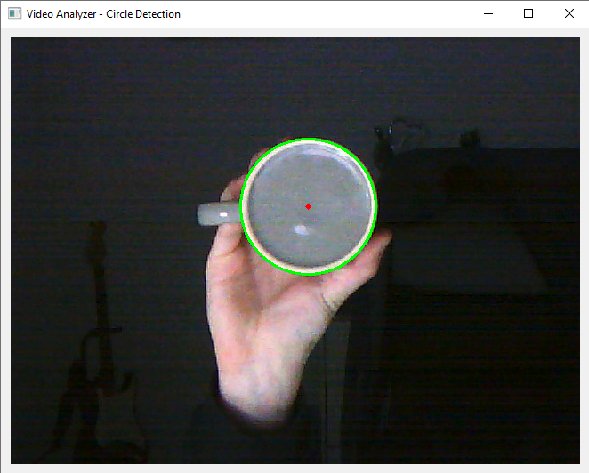
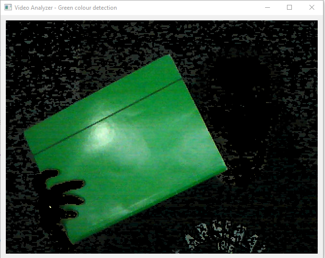
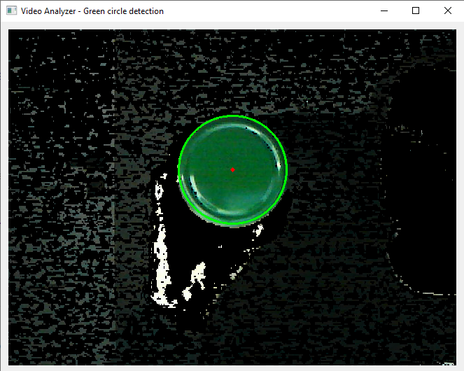

# Video Analyzer with OpenCV and PyQt5
> This application enables to detect circles and green objects on webcam
## Table of contents
* [Screenshots](#screenshots)
* [Technologies](#technologies)
* [Setup](#setup)
* [Features](#features)
* [Contact](#contact)

## Screenshots
* Green objects detection

* Circles detection                    

* Green circles detection

## Technologies
* Python 3.8.1
* numpy 1.20.1 
* opencv 4.5.1.48
* PyQt5 5.15.3

## Setup
To install and run app you will need to:
* Clone this repository to your computer or unpack .zip file in chosen directory,
* Run Visual Studio Code, Pycharm or another IDE,
* Type "cd YOUR_DIRECTORY\Video-Analyzer-master" in terminal,
* Command in IDE to install demanded packages:
> pip install -r requirements.txt
* Type "python main.py"

## Features
* Displaying screen from webcam,
* Detecting circles on screen,
* Detecting green colour on screen,
* Detecting both green colour and circles on screen

## Contact
Created by [@matedawid](https://linkedin.com/in/matedawid) - if you have any questions, just contact me!
